# KS EDITOR

When you first open the editor, make sure you save the layout and set your preferences under Utilities/Data Editor.

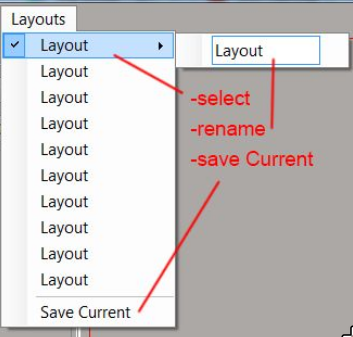
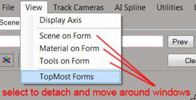
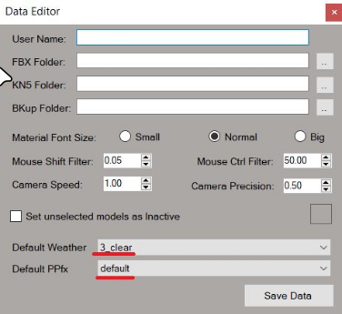

You can use the built-in Project Manager to save and manage projects:

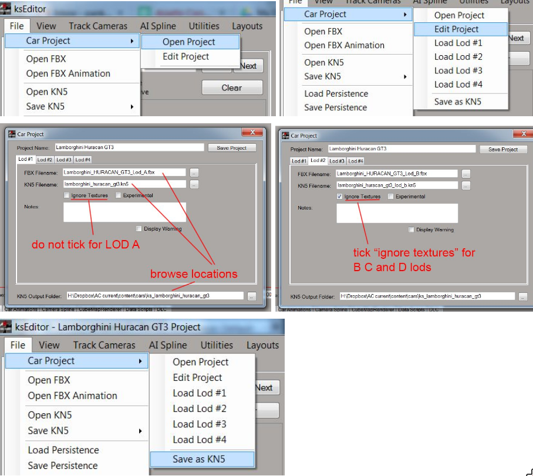

Scene illumination in the editor can be changed under the Illumination tab:

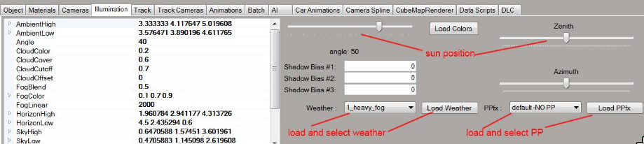

You can review your textures using the Texture Review tool under Utilities/Texture Review:

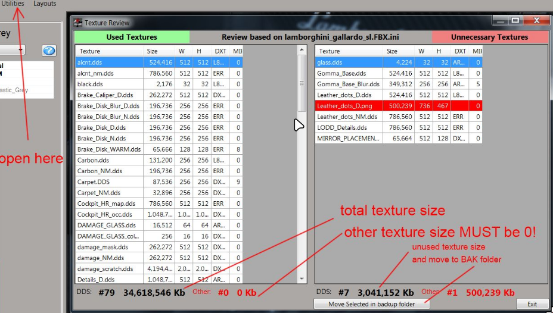

Transparencies and cast shadow settings can be applied globally to materials under the Materials tab:

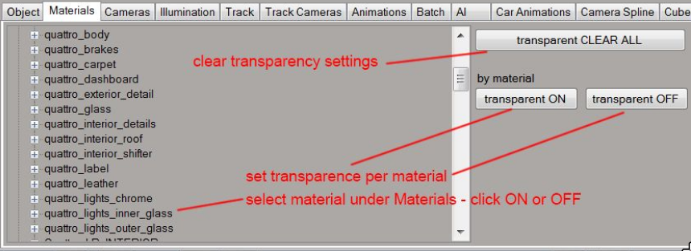

Persistence files (containing shader and object settings) can be saved under File. You can also load existing persistence files from higher LODs.
Note that loading a persistence file on a new export will only transfer shader settings, transparencies and cast shadow settings will have to be set manually.
However, for later persistence updates using the load function (once the transparencies are set), the transparencies will not have to be set again.

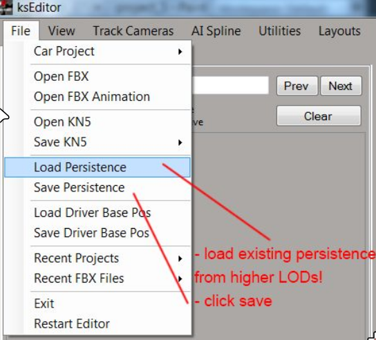

## Alpha modes

Where possible try to avoid using Alpha Blend mode.
Blend requires transparency, which can cause issues with draw priorities, because some objects can be viewed from two directions.
A common issue is the interior: interior objects sometimes (such as the transparent interior windshield banner) need a priority set to 1 to avoid the object being drawn before the external glass objects when viewed from outside.

However, from cockpit view, this can cause issues with the blurred rim on opponent cars, because the blurred spokes object with a priority of 0 will draw before the interior banner, if for example it goes around the windshield.

Of course, Alpha Blend mode is still required for glass objects and the blurred rim spokes.

When using priorities, make sure the priority is applied on the object level, not the sub-object level.
Additionally, if the transparent object is linked to a helper, you have to assign the priority on the highest level in the hierarchy, thus the helper itself.

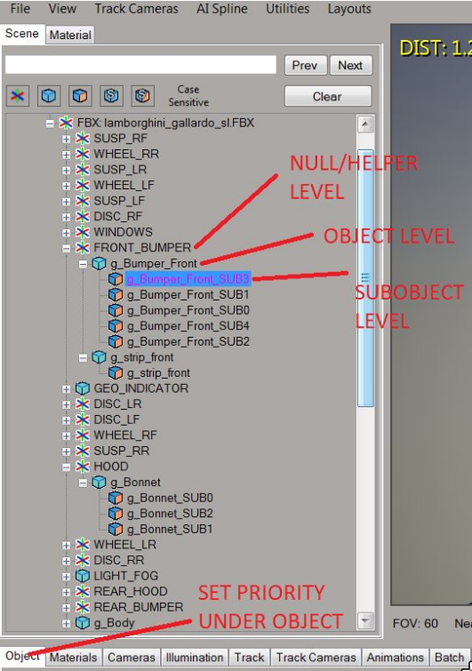

It is recommended to detach all transparent object as separate objects in your 3D software before exporting.
AVOID including transparent objects in a group object with multiple material IDs.
This is very important because otherwise adding a new materiaI ID later on could cause the transparency and cast shadow settings to “migrate” to another subobject, incorrectly assigning transparency to otherwise opaque pieces of mesh.

Alpha Test mode usually works to a satisfying level when the alpha has no gradient.
Alpha Test requires no transparency, which is why no issues will arise if more layers are in front of one another.
In Alpha Test materials, transparency is defined by the Alpha channel in the Normal Map.

Alpha Test mode can also be used to hide certain objects using a simple texture (make sure you disable shadow casting for those objects).
Remember that you control transparency with the Normal Map alpha channel.

Opaque mode is required for non-transparent objects, or where the shape of objects is defined by the mesh.
Make sure you don’t group objects with different properties in this respect under the same material.
If you have objects that require the alpha channel to define their border, group them under a new material.
As a general rule, keep alpha and non-alpha objects in separate materials.

## Shader types

Below you find a few shader types used for specific parts of the vehicle, showing the recommended shader and blending mode (note that other properties are merely representative):

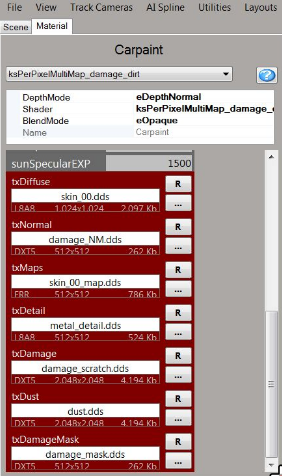
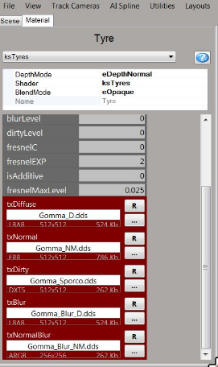
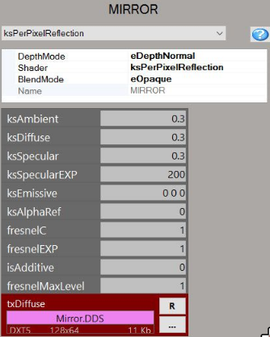
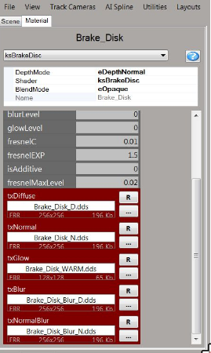
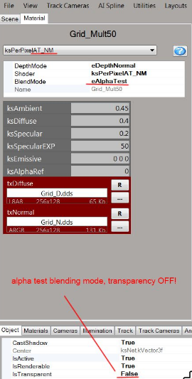
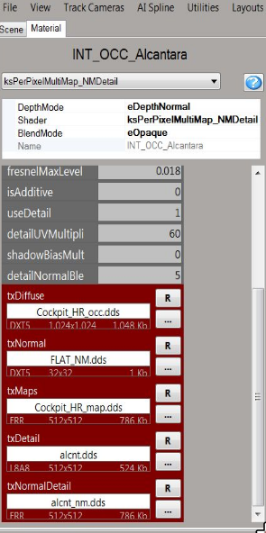
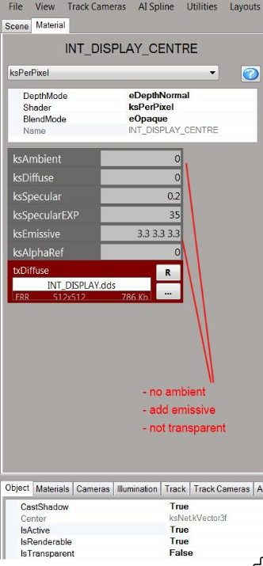
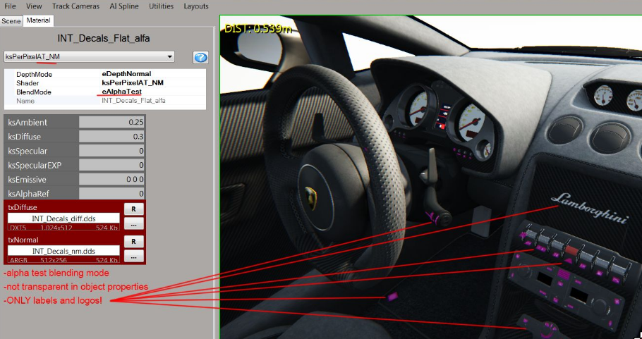
