# How to mod a car for Asseto Corsa

## Table of Contents

- [REQUIREMENTS](#requirements)
- [PROJECT AND FOLDER STRUCTURE](#project-and-folder-structure)
- [BUDGET](#budget)
- [SCENE STRUCTURE](#scene-structure)
  - [MESH PARTS OF A GENERIC CAR MODEL](#mesh-parts-of-a-generic-car-model)
  - [MESH NAMING CONVENTIONS](#mesh-naming-conventions)
  - [SETTING UP THE CAR MODEL INSIDE THE 3D SPACE](#setting-up-the-car-model-inside-the-3d-space)
  - [HIERARCHY and ORIENTATION](#hierarchy-and-orientation)
- [FUNCTIONAL MESH ELEMENTS](#functional-mesh-elements)
  - [LEDs and DIGITAL DISPLAYS](#leds-and-digital-displays)
  - [SEATBELTS](#seatbelts)
  - [LIGHT MESH AND SCRIPTS](#light-mesh-and-scripts)
  - [SKINNED MESH](#skinned-mesh)
  - [DRIVER POSITION AND MESH](#driver-position-and-mesh)
  - [DRIVER ANIMATIONS](#driver-animations)
  - [DRIVER SCRIPTS](#driver-scripts)
  - [COLLIDER](#collider)
- [FUNCTIONAL TEXTURES](#functional-textures)
  - [CAR SHADOWS](#car-shadows)
  - [CAR MIRRORS](#car-mirrors)
  - [INTERNAL WINDSCREEN AND DOOR GLASS REFLECTION](#internal-windscreen-and-door-glass-reflection)
  - [DAMAGE GLASS](#damage-glass)
  - [CAR DAMAGE](#car-damage)
- [TEXTURING GUIDELINES](#texturing-guidlines)
  - [TEXTURE NAMING CONVENTIONS FOR PSD SOURCE FILES](#texture-naming-conventions-for-psd-source-files)
  - [EXPORTING TEXTURES AND OPTIMISATION](#exporting-textures-and-optimisation)
  - [OPTIMAL USE OF TEXTURE SPACE](#optimal-use-of-texture-space)
  - [BAKING THE AMBIENT OCCLUSION](#baking-the-ambient-occlusion)
- [ANIMATIONS](#animations)
  - [SUSPENSION ANIMATION](#suspension-animation)
  - [SUSPENSION HIERARCHY](#suspension-hierarchy)
  - [STEER ARMS AND DIRECTION CONSTRAINTS](#steer-arms-and-direction-constraints)
  - [CONSTRAINT FULL ANIMATION SETUP](#constraint-full-animation-setup)
  - [ANIMATION EXPORTING](#animation-exporting)
  - [CLIPS AND NAMING CONVENTIONS](#clips-and-naming-conventions)
  - [EXPORTING ANIMATIONS FROM THE EDITOR](#exporting-animations-from-the-editor)
  - [CHECKING CAR ANIMATIONS](#checking-car-animations)
  - [GENERIC ANIMATION EXPORTING GUIDELINES](#generic-animation-exporting-guidelines)
- [MATERIALS](#materials)
  - [MATERIAL NAMING CONVENTIONS](#material-naming-conventions)

## REQUIREMENTS

1. Export all files in the format supported by the **FBX version up to the 2014/2015** plugin for XSI and 3dsMAX.
2. The FBX data used by the AC engine are following:
   - Polygon mesh
   - Normals (custom normals are supported)
   - Texture coordinate UV (one layer only is read from the AC engine)
   - Bones with vertex weight
   - Nulls/dummies/nodes
   - Hierarchy structure
   - Animation data
   - Basic mesh transformation (scale, rotation, position)

**NOTE:**

- **The AC engine does not support 2 OBJECTS with the same NAME in the same
  model. This will cause the game to crash.**
- Every mesh MUST have one TEXTURE UV set.
- The mesh must be (when possible) in quads. Do NOT triangulate the mesh if it is not necessary.
- For a skinned mesh you can have as many bones as needed, but every single vertex can be
  influenced by up to 4 bones and not more.

## PROJECT AND FOLDER STRUCTURE

A vehicle project consists of a total of 5 models

- high-poly models
- 3 additional Level of Detail (LOD) models and a low-poly collider
- The naming of the source files must be consistent with the make/type of the vehicle at hand

The recommended way to set up your project folder is the following:

```sh
.
├── animations/                  [File folder]
├── PSD/                         [File folder]
├── texture/                     [File folder]
├── collider.fbx                 [FBX File]
├── collider                     [Configuration settings]
├── FORD_escort_MK1.kscp         [KSCP File]
├── FORD_Escort_mk1_lod_A        [FBX File]
├── FORD_Escort_mk1_lod_A        [Configuration settings]
├── FORD_Escort_mk1_lod_B        [FBX File]
├── FORD_Escort_mk1_lod_B        [Configuration settings]
├── FORD_Escort_mk1_lod_C        [FBX File]
├── FORD_Escort_mk1_lod_C        [Configuration settings]
├── FORD_Escort_mk1_lod_D        [FBX File]
└── FORD_Escort_mk1_lod_D        [Configuration settings]

```

**NOTE:**

- The `.ini` files are created by the AC Editor and include the object and shader properties for the models.
- The folder called `texture` is obligatory for the editor to load the texture files.
- The `.kscp` file is a project file created by the AC Editor.

## BUDGET

The following triangle-counts are recommended in most cases.

**Exterior:**

- LOD A exterior: 125,000 triangles
- LOD B exterior: 20,000-25,000 triangles
- LOD C exterior: 10,000-12,000 triangles
- LOD D exterior: 2,000-3,000 triangles (as low as possible while you can keep the main shape)

**Interior:**

- HR Cockpit: 125,000 triangles
- LR Cockpit: 7,000-10,000 triangles
- LR Cockpit in LOD B: 4,000 triangles (as low as possible while keeping a decent quality)
- LR Cockpit in LOD C: 2,000 triangles (some detail must remain above window level)

## SCENE STRUCTURE

In order to work in-game, the car needs specific nulls to present in all LODs, making sure that all
car parts are functioning properly.

**Nulls that MUST be present in ALL LODs:**

```
SUSP_LF      suspension Left Front
SUSP_LR      suspension Left Rear
SUSP_RF      suspension Right Front
SUSP_RR      suspension Right Rear
WHEEL_LF     wheel Left Front
WHEEL_LR     wheel Left Rear
WHEEL_RF     wheel Right Front
WHEEL_RR     wheel Right Rear
COCKPIT_LR   cockpit Low resolution node
STEER_LR     steer Low resolution node
DISC_LF      brake disc Left Front
DISC_LR      brake disc Left Rear
DISC_RF      brake disc Right Front
DISC_RR      brake disc Right Rear
```

There are secondary nulls that are needed to complete the car, but are not essential, so it
means that in some cases those object can be excluded from certain LODs:

```
COCKPIT_HR   cockpit High resolution node (A only)
STEER_HR     steer High resolution node (A only)
RIM_LF       rim Left Front (A and B)
RIM_LR       rim Left Rear (A and B)
RIM_RF       rim Right Front (A and B)
RIM_RR       rim Right Rear (A and B)
RIM_BLUR_LF  rim Blurred Left Front (A and B)
RIM_BLUR_LR  rim Blurred Left Rear (A and B)
RIM_BLUR_RF  rim Blurred Right Front (A and B)
RIM_BLUR_RR  rim Blurred Right Rear (A and B)
```

When it is required to manually animate the suspension, or the car has Dion axle suspension,
you have to include some extra nulls in your scene:

```
REAR_AXLE    for the center of rotation of the Dion Trunk axle
HUB_LF       Hub for the suspension Left Front
HUB_LR       Hub for the suspension Left Rear
HUB_RF       Hub for the suspension Right Front
HUB_RR       Hub for the suspension Right Rear
```

Nulls/dummy used to define the broken glass mesh:

```
DAMAGE_GLASS_CENTER_1  (A and B)
DAMAGE_GLASS_FRONT_1   (A and B)
DAMAGE_GLASS_REAR_1    (A and B)
DAMAGE_GLASS_LEFT_1    (A and B)
DAMAGE_GLASS_RIGHT_1   (A and B)
```

For the DAMAGE of car elements, the following nulls must be placed in the PIVOT point of the
object around which the object rotates upon impact. The naming conventions for damageable
parts are the following:

```
FRONT_BUMPER    (A and B)
REAR_BUMPER     (A and B)
MOTORHOOD       (A and B)
REAR_HOOD       (A and B)
FRONT_WING      (A and B)
REAR_WING       (A and B)
REAR_EXTRACTOR  (A and B)
```

Additional dummies can be:

```
WIPER_#                for wiper animation (A, B and C)
FRONT_LIGHT            for headlight animation (A, B and C)
DISPLAY_DATA           for digital displays (A only)
DOOR_L and DOOR_R      for exterior door animation (A and B)
DOOR_L_1 and DOOR_R_1  for interior door animation (A only)
```

### MESH PARTS OF A GENERIC CAR MODEL

The components of a car must be divided in many parts in order to manage animated objects, meshes
and other features present in game. Here is a list of mandatory and optional mesh objects.

**Common exterior parts:**

```
MAIN BODY        Required - must be present in LOD A and LOD B
DOORS            optional - only in LOD A if present on the model. In LOD B the doors are not animated but welded to the main body
MOTORHOOD        Depends on car type - if needed, must be present in LOD A and LOD B
FRONT BUMPER     Depends on car type - if needed, must be present in LOD A and LOD B
REAR BUMPER      Depends on car type - if needed, must be present in LOD A and B
WHEEL HUB        Optional - contains the brake calipers must exist on LOD A and LOD B
WHEEL RIM        Required - must be present in LOD A and LOD B. In LOD C the wheels are simplified.
WHEEL RIM BLUR   Required - a version of the rim but with a blurred texture, must be present in LOD A and LOD B
WHEEL TYRE       Required - must be present in LOD A and LOD B. In LOD C the wheels are simplified
BRAKE DISK       Depends on car type - if needed, must be present in LOD A and LOD B
FRONT LIGHT      Depends on car type - if needed, must be present in LOD A, LOD B and LOD C
REAR LIGHT       Depends on car type - if needed, must be present in LOD A, LOD B and LOD C
WIPERS           Depends on car type - if needed, must be present in LOD A, LOD B and LOD C
FRONT WING       Depends on car type - if needed, must be present in LOD A, LOD B and LOD C
REAR WING        Depends on car type - if needed, must be present in LOD A, LOD B and LOD C
```

**Cockpit mesh parts:**

```
COCKPIT_HR       Required - high resolution cockpit, the one that you see in cockpit view. Low Resolution (LR) version also required, including LOD B and LOD C
STEER            Required - steering wheel HR and LR interior, LOD B and LOD C
STEER PADDLE     Depends on car type, required also in Low Resolution (LR) and LOD B
SHIFT            Depends on car type - required also in Low Resolution (LR) and LOD B
SEATBELTS        Depends on car type - if needed, required also in Low Resolution (LR) and LOD B and LOD C. In LOD A, both ON and OFF position required. In LR, LOD B and C only the ON position model is needed! ON position needed only for the driver, not the passengers.
```

### MESH NAMING CONVENTIONS

**NOTE:**

- Use a pre-tag such as `MESH_` or `GEO_` for mesh objects to differentiate them from null objects.
- Make sure you keep the same names for functional objects (lights and other emissives etc.) throughout the entire scene for all LODs to ensure that the scripts works as intended for each LOD.
- You can choose to name your objects based on location (when using multi-materials), such as GEO_front_bumper and GEO_main_body (in this case there will be sub-objects divided by the editor at exporting), or based on material grouping, such as GEO_paint_body and GEO_chromes_body.

### SETTING UP THE CAR MODEL INSIDE THE 3D SPACE

**NOTE:**

- The car must be oriented as shown in the image: The Z vector must be the front direction
- The model must be placed with the wheels touching the ground on the 0 coordinate (Y)
- The model bounding box must be centered in `YXZ = 0.0.0`.
- The car must have 4 different Level of Detail models that must share the same position and orientation!

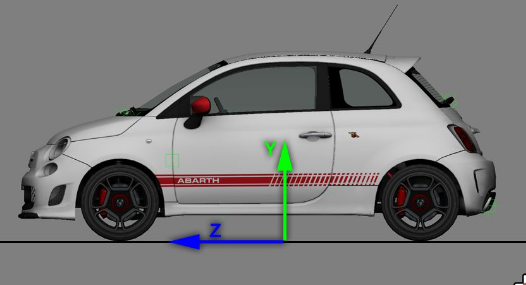

### HIERARCHY and ORIENTATION

**NOTE:**

- Any object that is not a child of a NULL/ DUMMY will be managed like part of the CAR CHASSIS.
- All the pieces of the geometry that belong to the car must be placed in a HIERARCHY to define the specific properties of each mesh object in the game.

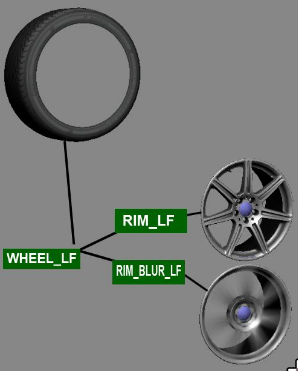

**NOTE:**

- Remember that every NULL is also the CENTER of rotation. If your mesh is not properly placed under a NULL with a correct center of rotation, the mesh will rotate the wrong way.
- See the example on the left: the geometry of the WHEEL is centered exactly on the NULL.
- The **BRAKE DISK** must have the center in the same EXACT position of the wheel and the rims.

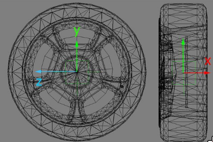

## FUNCTIONAL MESH ELEMENTS

### LEDs and DIGITAL DISPLAYS

Each individual LED (such as for RPM, boost or KERS) or bar TAG must be a separate object and
numbered in a series:

```
LED_RPM_# where the “#” is the number of each specific item in a series
TAG_RPM_#
KERS_CHARGE_#
KERS_INPUT_#
TURBO_#
```

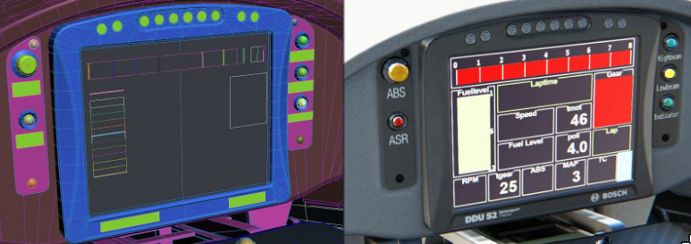

There are two ways to control specific items on the dashboard.

- The first one is where the mesh is always present and the script controls the emissive value on a per object basis. This is the method used for RPM LED series, headlight indicators and ignition status lights.
- The second method the mesh is disabled by default and the script controls how and when it should appear with the shader and object properties set up in the editor. It should be noted that the meshes appear in the editor and the showroom. This is used for dynamic RPM bar graphs, boost bar graphs, fuel level bars, shift indicators, fuel warning lights and KERS bar graphs.

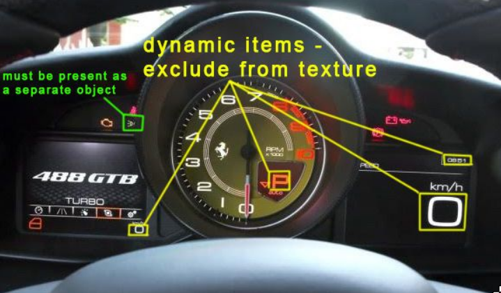

**NOTE:**

- Do NOT use the convention `_01`, `_02`, `_03` etc. for single digits for the suffix of tag
  object names, always use `_0`, `_1`, `_2` etc. E.g. `LED_RPM_0`, `LED_RPM_1` etc.

  The following items are currently supported by the game engine:

  ```
  Time
  Gear
  Speed
  RPM
  Water temperature
  Fuel level (bar graph)
  Fuel level (litres)
  KERS charge (bar graph)
  KERS input (bar graph)
  Turbo boost (bar graph)
  Turbo boost (pressure)
  Lap time
  Previous lap time
  Difference from previous lap
  TC setting
  ABS setting
  Headlight indicator
  Fuel warning light
  Current lap
  Total laps
  Ambient temperature
  Km with current fuel left
  KERS charge readout
  Estimated fuel
  Any RPM-dependent status indicator
  Tyre pressure
  G-meter
  Placeholder script for any static text or numbers
  ```

  **IMPORTANT:**
  - If there is a digital display, create a NULL called DISPLAY_DATA with the orientation shown in the image below.
  - The `DISPLAY_DATA` null is the reference for the items in the `digital_instruments.ini`, it serves as a reference point and makes sure the text appears on the same surface as the display. For this reason if the display is rotated/tilted, the null must follow the same orientation.
  - To avoid clipping, place the null so that its pivot point is in front of the mesh by a few millimetres and not directly on it.

  See [details](https://www.assettocorsa.net/forum/index.php?threads/analog-digital-instruments-lights-q-a-request-official-support-here-check-first-post.12249/)

DISPLAY_DATA null orientation and examples:

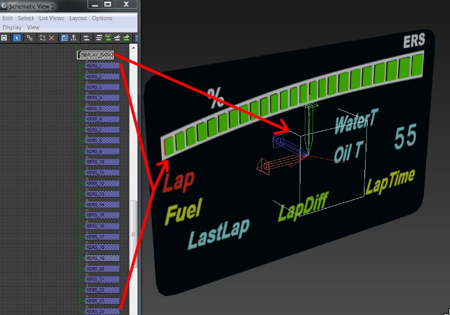
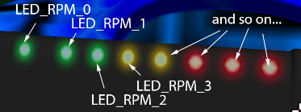
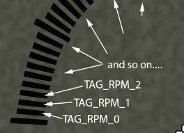

### SEATBELTS

The cockpit contains two different mesh objects for the belts: One for the belt ON and another for the belt OFF.
These two meshes must be linked as a child of the null COCKPIT_HR and must be named as follows:

```
CINTURE_ON    for the belt on the driver when is driving
CINTURE_OFF   for the belt on the seat, without driver (showroom view)
```

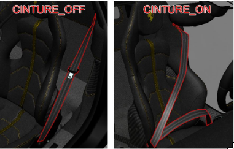

The seatbelt mesh must be modelled also in the cockpit LR but only the CINTURE_ON mesh.

**NOTE:**

- The names are in ITALIAN (CINTURE = SEATBELT)
- The seatbelt mesh must be modelled also in the cockpit LR but only the CINTURE_ON mesh.

### LIGHT MESH AND SCRIPTS

The light mesh objects must be separated and detached from the body of the car and use specific naming conventions.
The mesh name must be controlled from the `lights.ini` script.
The same scripts include the instructions for the ON/OFF conditions, as well as the light emission colour.

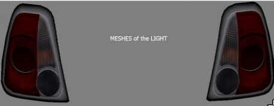
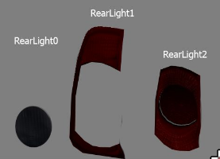

**NOTE:**

- There is no need to split the lights up as “right” and “left”. They can be one mesh because they turn on together.

**IMPORTANT:**

- Each light source must be **detached** as a separate object, avoid keeping all the difference reflectors and bulbs in one object.
- This way, each element can be controlled individually to achieve realistic results

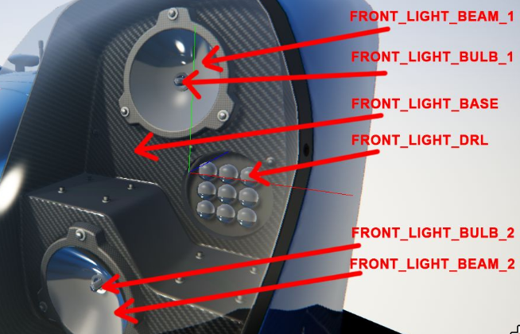

The script `lights.ini` contains the following values:

```
[HEADER]
VERSION=3               Script version. Keep this value like is.

[BRAKE_0]
NAME=REAR_LIGHT         name of the mesh to light up
COLOR=500,60,40 RGB     value when you press the brake pedal
OFF_COLOR=50,12,8 RGB   value for position light when brakes are off

[LIGHT_0]
NAME=FRONT_LIGHT name   of the mesh to light up
COLOR=240,195,180 RGB   emissive value when the front light is on
OFF_COLOR=50,50,70 RGB  emissie value for day-light (optional)
```

The COLOR= value assigns a colour when the brakes are on (you are pressing brake pedal).
The line below OFF_COLOR= is the emissive value of the brake light (in some cars, the same mesh is lit up when you turn the lights on and when you brake).

**NOTE:**

- For a glowing brake light we recommend an R (red) value between 150 and 850.
- For day running lights, we recommend values between 40 and 100.
- For high beams, we recommend values ranging from 250 to 800.

### SKINNED MESH

**Maybe interasting**

### DRIVER POSITION AND MESH

**Maybe interasting**

### DRIVER ANIMATIONS

**Maybe interasting**

### DRIVER SCRIPTS

**Maybe interasting**

### COLLIDER

The collider shape must be a simple solid object with as low polygon count as possible, without any UV or texture.
The collider’s pivot must be in the `0,0,0` coordinates and have the same orientation as the wheel dummies.

**Rules for collider objects:**

1. The collider should have no more than 40/60 triangles.
2. A material called `GL` must be assigned to the collider inside the editor. This is a special material specifically made for a mesh that is not rendered. Meshes with this material are used only for collisions.
3. The collider must not extend below the floor of the car.
4. The collider must have no holes. The mesh must be completely closed.
5. Once the collision mesh is done, simply export the kn5 from the editor, using name `collider.kn5`.

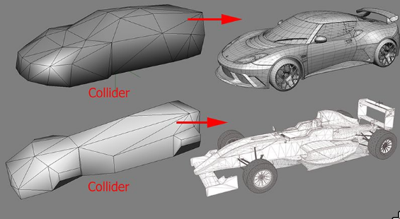
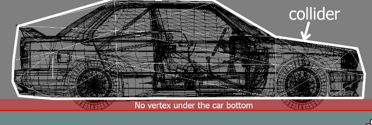

**IMPORTANT:**

- Make sure you save with NO textures!
- The file must be placed in the same folder as the car LODs with the name `collider.kn5`.

## FUNCTIONAL TEXTURES

### CAR SHADOWS

For each car there are five shadow textures.
Four textures dedicated to each wheel and another one for the car body.

**NOTE:**

- If not present, the car body texture is automatically generated once in game, otherwise an existing one is used.
- The auto-generated shadow of the car is very ROUGH. They must be edited in order to obtain a smoother result.

**See docs if needed one**

### CAR MIRRORS

In order to make car mirrors work, a material must be created (the name is not important), and assigned to the mirror mesh objects.
This texture is mirrored and the UV must be mirrored as well to make sure it appears correctly.

The texture is divided in three areas:

- CENTRAL must fit the central internal mirror of the car.
- The red shows the left,
- while the blue shows the right hand side mirror.

**IMPORTANT:**

- The mesh must be mapped with the texture called `MIRROR_PLACEMENT`.

**NOTE:**

- The 2 points at the center of the lines indicate a point that must be placed in the center of the mirror to make sure that the cars behind can be clearly seen.
- remember to keep the correct aspect ratio of mirror UV, otherwise the image of the reflection will be distorted.
- The image ratio of the `MIRROR PLACEMENT` template is `4:1`.
- Only use the `MIRROR_PLACEMENT` texture for UV mapping, the actual texture in the editor should be a flat texture named `mirror.dds`.


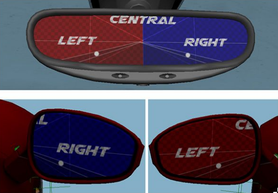

### INTERNAL WINDSCREEN AND DOOR GLASS REFLECTION

**Maybe interasting**

### DAMAGE GLASS

The car can have 2 kinds of damage: damage to glass objects and the body.

For the glass we have to do the following:

1. Duplicate the glass object, assign to it a new material and map it using the texture you can find in the Texture common folder called `Glass_Crack_00.psd`.
2. Then, move it away (0.5mm or less) from the original glass to avoid clipping.
3. Try to map the glass approximately as shown here (at least for the front windscreen), because the broken glass must allow the driver to see the road in the game.
4. The cracks must be more visible in the corners and less so in the center.


**See docs if needed one**

### CAR DAMAGE

**Maybe interasting**

## TEXTURING GUIDELINES

The supported texture format is: **directX DDS**

This format can be outputted from Photoshop (for example) using the specific nVidia plugin [here](https://developer.nvidia.com/legacy-texture-tools).

Inside every folder we need a base layer that allows us to change important features of the texture. Follow these rules:

- If the texture has an ALPHA CHANNEL, do not collapse transparent features, keep the transparent features in a specific layer.
- If there is a normal map, provide in the layer also the greyscale texture so that it can be re-generated with the nVidia tool.
- ALWAYS work with DOUBLE resolution (no more no less) of the target image and shrink it to the right size only when you export the DDS. Test your results to be sure that the reduction does not spoil the image too much (this could happen with tiny texts or symbols).
- All PSD files must be in RGB Color 8 bit for channel mode
- Name them correctly following our naming conventions.
- use the DXT5 compression for high-resolution textures.

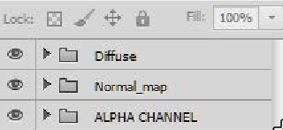

### TEXTURE NAMING CONVENTIONS FOR PSD SOURCE FILES

```
Skin.PSD                    contains the main body textures
Ambient occlusion
Wireframe                   (UV)
RGB Map                     (material specular-gloss-ref map)
Material IDs and zones
Alpha channel

Ext_Details.PSD             contains rivets, bolts, logos, and decals on the exterior
Diffuse
Normal map
Ambient occlusion
RGB Map                     (material specular-gloss-ref map)
Alpha channel

Rims.PSD                    contains rim base and rim blur texture plus the blurred spokes
Diffuse
Normal map
Ambient occlusion
RGB Map                     (material specular-gloss-ref map)
Alpha channel

Calipers.psd                contains the brake caliper texture
Diffuse
Normal map
Ambient occlusion
RGB Map                     (material specular-gloss-ref map)
Alpha channel

Lights.psd                  contains the light texture
Diffuse
Normal map
Ambient occlusion
RGB Map                     (material specular-gloss-ref map)
Alpha channel

Mechanics.psd               contains the underside, engine and all the parts that are not included in the skin
Wireframe                   (UV)
Diffuse
Normal map
Ambient occlusion
RGB Map                     (material specular-gloss-ref map)
Alpha channel

Glass.psd                   contains the glass texture and all similar parts such as black frame
Diffuse
Normal map
Alpha channel

Grids.psd                   contains tileable grids and similar textures (use more if needed)
Diffuse
Normal map
Ambient occlusion
RGB Map                     (material specular-gloss-ref map)
Alpha channel

Tyre.psd                    contains tyre textures with blur and dirt
Wireframe                   (UV)
Diffuse
Normal map
Ambient occlusion
Alpha channel

Disc.psd                    contains the brake disc texture and the glow texture
Wireframe                   (UV)
Diffuse
RGB Normal map
Glow map
Windscreen.psd              contains the fake internal glass reflection
Diffuse
Alpha channel

INT_Decals.psd              contains dials, dashboard symbols, cockpit details and logos, plates and interior bolts and stickers
Diffuse
Normal map
Ambient occlusion
RGB Map                     (material specular-gloss-ref map)
Alpha channel

INT_Details.psd             contains coloured gradients and other details to use for smaller objects
Diffuse
Normal map
Ambient occlusion
Alpha channel

INT_Occlusion.psd           contains the cockpit ambient occlusion texture
Wire frame stamp
Diffuse
Normal map
Ambient occlusion
RGB Map                     (material specular-gloss-ref map)
Alpha channel

Belts.PSD                   contains cockpit belts
Diffuse
Normal map
Seams.psd                   contains stitching, seams, and similar textures in tileable form
Diffuse
Normal map

INT_cockpit_LR.psd          contains cockpit LOW RESOLUTION texture
Ambient occlusion
Wire frame stamp
RGB Map                     (material specular-gloss-ref map)
Material ID and zones
Alpha channel
```

All the extra textures that can occur and are not mentioned here can have a name that explains in brief what they contain.

### EXPORTING TEXTURES AND OPTIMISATION

**Maybe interasting**

### OPTIMAL USE OF TEXTURE SPACE

**Maybe interasting**

### BAKING THE AMBIENT OCCLUSION

**Maybe interasting**

## ANIMATIONS

### SUSPENSION ANIMATION

**Maybe interasting**

### SUSPENSION HIERARCHY

The following DUMMY/NULLs are mandatory:

```
SUSP_LF           Left Front
SUSP_LR           Left Rear
SUSP_RF           Right Front
SUSP_RR           Right Rear

HUB_LF            Left Front
HUB_LR            Left Rear
HUB_RF            Right Front
HUB_RR            Right Rear

WHEEL_LF          parent of the TYRE_LF for the tyre mesh, RIM_LF for the Rim mesh, and RIM_BLUR_LF for the Rim Blurred mesh
WHEEL_LR          parent of the TYRE_LR for the tyre mesh, RIM_LR for the Rim mesh, and RIM_BLUR_LR for the Rim Blurred mesh
WHEEL_LR          parent of the TYRE_LR for the tyre mesh, RIM_LR for the Rim mesh, and RIM_BLUR_LR for the Rim Blurred mesh
WHEEL_RR          parent of the TYRE_RR for the tyre mesh, RIM_RR for the Rim mesh, and RIM_BLUR_RR for the Rim Blurred mesh
```

**NOTE:**
In order to have a correct direction of rotation, the Z axis of the transmission nulls always need to point forward.

**See docs if needed one**

### STEER ARMS AND DIRECTION CONSTRAINTS

**Maybe interasting**

### CONSTRAINT FULL ANIMATION SETUP

**Maybe interasting**

### ANIMATION EXPORTING

**Maybe interasting**

### CLIPS AND NAMING CONVENTIONS

**Maybe interasting**

### EXPORTING ANIMATIONS FROM THE EDITOR

**Maybe interasting**

### CHECKING CAR ANIMATIONS

**Maybe interasting**

### GENERIC ANIMATION EXPORTING GUIDELINES

**Maybe interasting**

## MATERIALS

### MATERIAL NAMING CONVENTIONS

**Maybe interasting**
