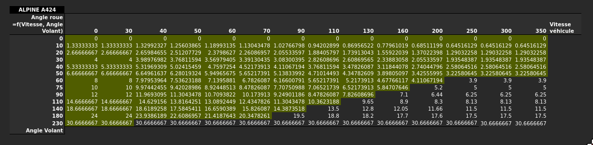
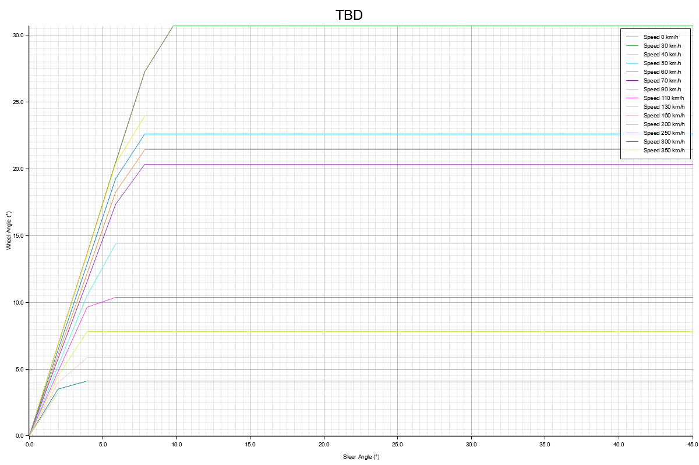
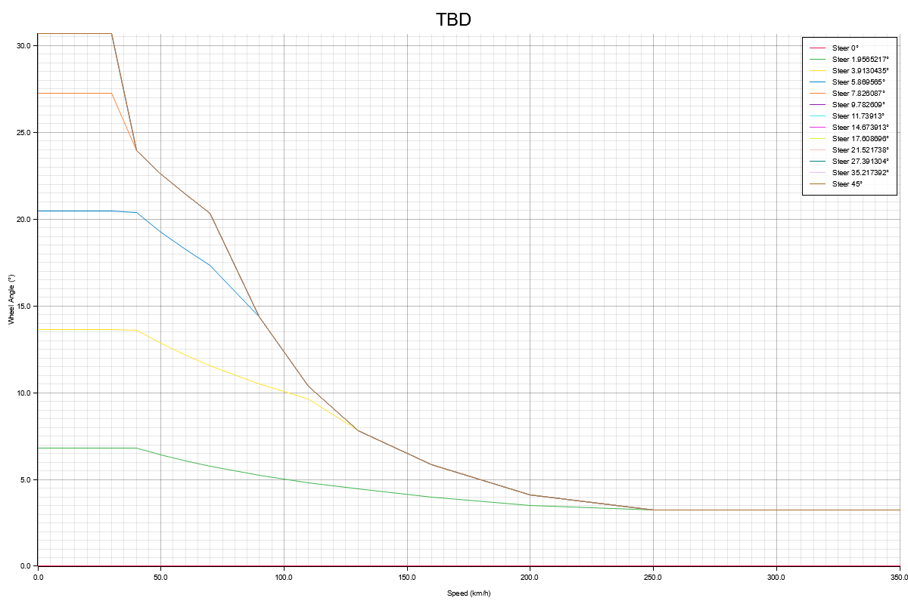
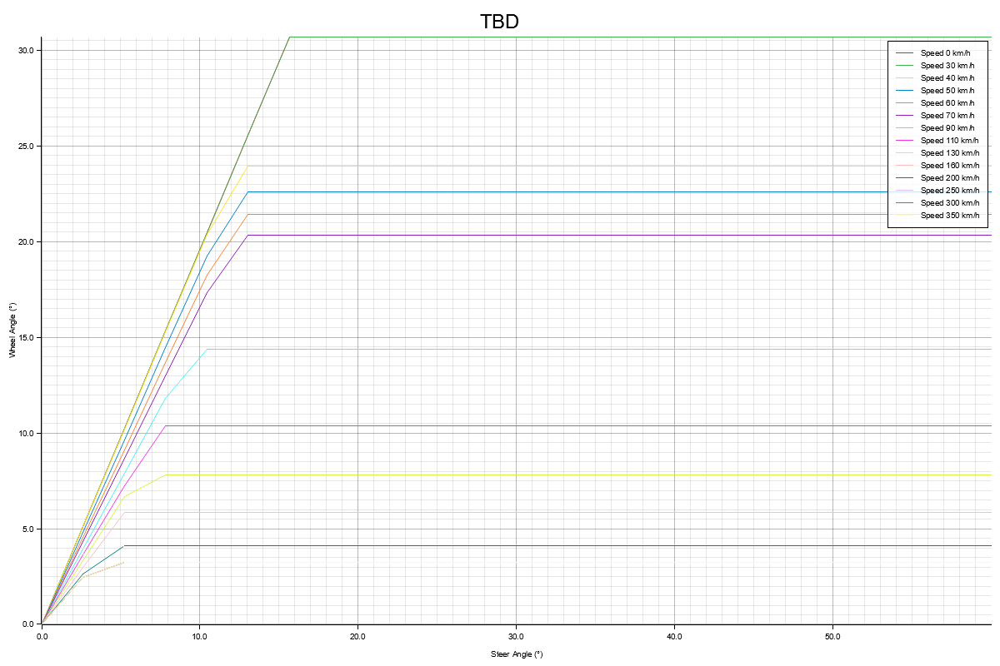
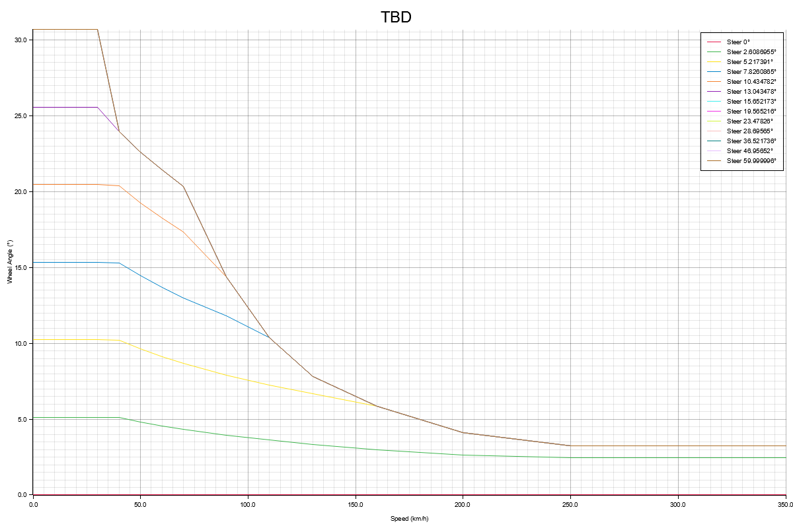
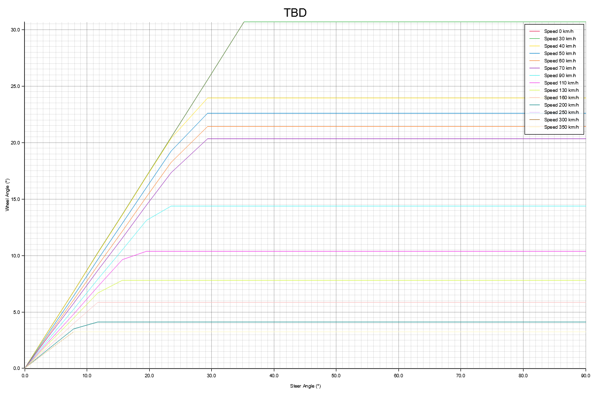
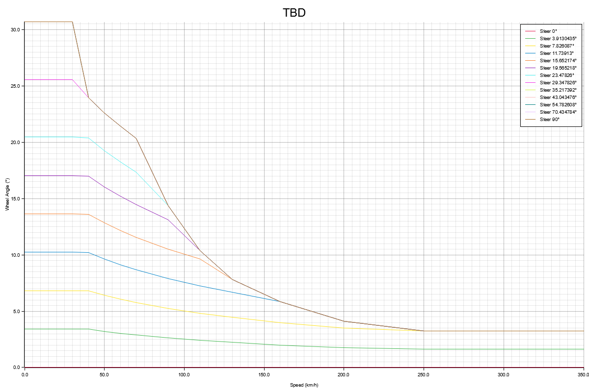
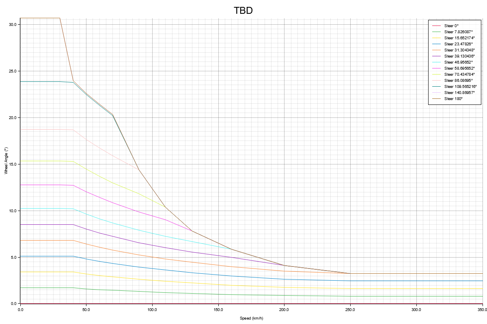

# Compte rendu Loi de SBW pour l'A424

## Raw Data

### Adaptation de la loi SBW

Pour notre cas pratique, le mode de commande n’est pas basé sur **230°**, mais sur **45°**.
Ainsi, pour adapter la loi SBW, nous appliquons un **facteur de correction** à l’angle volant en entrée, défini par :

${\sf angle\ corrigé}=\frac{230}{45}\times{\sf facteur}\times{\sf angle\ volant}$

Le **facteur** représente un pourcentage d’atténuation appliqué à la loi, car si nous conservons le rapport brut $\frac{230}{45}$, la sensibilité du volant devient trop élevée.

Nous proposons donc une **représentation graphique** de la loi SBW que nous appliquons aux commandes, selon deux variantes construites à partir des mêmes données :

- une en fonction de la **vitesse** ;
- une en fonction de l’**angle volant**.

> Note: Gardez à l’esprit que notre angle volant maximal est de 45°. Ainsi, lorsque nous appliquons un facteur inférieur à 1.0, le graphique peut afficher un angle volant supérieur à 45°, mais en pratique, nos commandes ne peuvent pas dépasser cette valeur.

## Facteur 1.0

## Facteur 0.75

## Facteur 0.5

## Facteur 0.25

